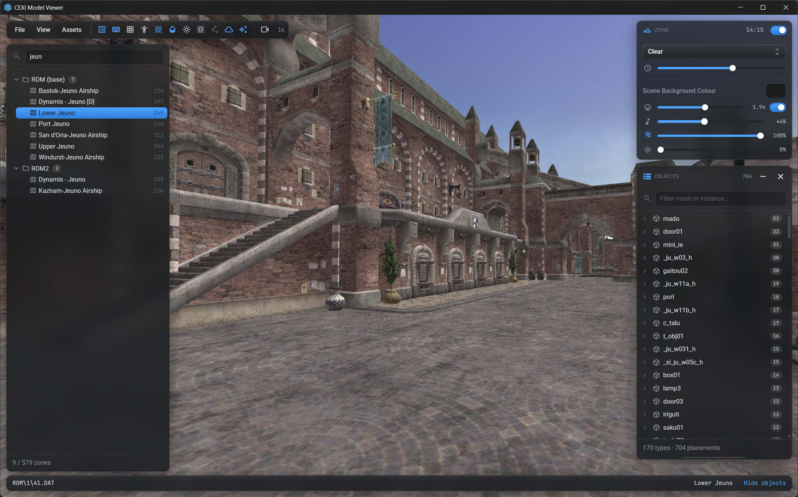
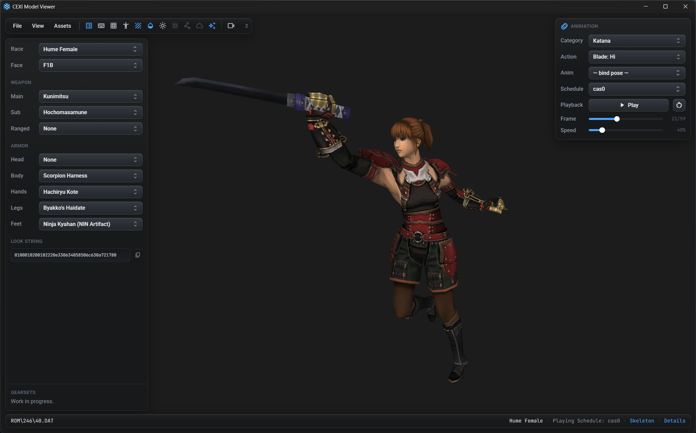

# CEXI Model Viewer

A FFXI asset browser — **zones, NPCs & monsters, playable characters, textures,
music and sound effects** — with a **WebGL2** viewport, wrapped in a **Tauri 2**
shell (~7 MB standalone exe, no Electron). Skinning runs on the GPU: the vertex
shader rotates pre-weighted joint-local positions by per-joint pose quaternions;
the CPU only evaluates the skeleton pose (one quat/trans/scale triplet per joint
per frame).

## Download

Get the latest release by going to: [Github Releases](https://github.com/CatsAndBoats/cexi-viewer/releases)

## Features

- **Zones** — full zone geometry with day/night time-of-day and weather
  (auroras, fog, rain, …), adjustable brightness and scene background, a
  searchable object/placement browser, and zone BGM + ambient sound effects.
- **NPCs & monsters** — a categorised tree of every entity model. Play any of
  its animations or schedules, scrub the timeline frame-by-frame, set playback
  speed (10–200 %), and inspect the bone hierarchy in a skeleton overlay.
- **Characters** — compose a PC from race, face, weapons and gear. Gear is
  grouped by set (Artifact / Relic / Empyrean / Ebur / Furia / Ebon) and sorted
  A–Z; equipped weapons play their weapon-skill animations; the 40-character
  look string is generated and copyable.
- **Images** — browse every UI, map and cutscene texture DAT with a filter,
  per-set list and zoom.
- **Music & Sound FX** — play any BGW/SPW track (vgmstream-decoded) with a live
  waveform visualiser, seek bar and loop info.
- **Throughout** — type-to-filter dropdowns, arrow-key list navigation,
  reveal-any-DAT in the system file manager, wireframe / unlit / collision /
  navmesh / skybox overlays, and glTF/FBX model export (via the cexi-tools CLI).

## Screenshots

Zones render with weather and time-of-day; the object browser lists every placement:




NPCs and monsters play their animations, with a frame scrubber and speed control:


Compose a character from gear and weapons, and preview weapon-skill animations:



Browse textures, and play music / sound effects with a waveform visualiser:


---

## Setup

| Path | Purpose |
|---|---|
| `ui/` | Frontend, built by Vite. `ui/js/` is the engine as vanilla ES modules — `dat.js` (DAT section walker + skeleton/mesh/texture/animation parsers), `pose.js` (pose evaluation), `renderer.js` (WebGL2, GPU skinning, DXT via `WEBGL_compressed_texture_s3tc` + CPU fallback), `camera.js`, `backend.js`, audio/particle helpers. `ui/src/` is the React UI (viewport, panels, asset lists). |
| `src-tauri/` | Rust shell. IPC commands for filesystem access (`list_dir`, `read_file`, `write_file`), native pickers, audio decode (`decode_vgmstream`), model export (`cexi_mesh_export`), and reveal-in-file-manager (`reveal_path`). |
| `dev/serve.py` | Dev server: serves `ui/` plus `/fs` endpoints so the frontend runs in a plain browser without Tauri (`backend.js` falls back automatically). |
| `dev/bake-lists.mjs` | Regenerates the baked asset lists in `ui/public/lists/` (races, gear, NPCs, music, SFX) from source data. |

## Build & run

Requires Rust (no Node needed):

```
Start.bat          (Windows)
./start.sh         (macOS / Linux)
```

Release build (embeds the Vite frontend, standalone binary):

```
Build.bat          (Windows)
./build.sh         (macOS / Linux — pass --bundle for a .dmg/.AppImage)
```

or:

```
cd src-tauri
cargo run
```

Release exe: `cargo build --release` → `src-tauri/target/release/cexi-model-viewer.exe`
(frontend assets are embedded; the exe is standalone, needing only the WebView2
runtime that ships with Windows 11).

Browser dev mode (no Rust):

```
python dev/serve.py 8766
```

then open http://localhost:8766. `window.cexi` exposes the renderer for
debugging.

## Environment variables

Machine-specific paths default to the original hardcoded Windows values; set the
matching variable to override one. Unset or blank means "use the default".

Copy `.env.example` to `.env` (git-ignored) to set them persistently:

```
cp .env.example .env
```

The repo-root `.env` is read by `start.sh`, `build.sh`, the Tauri app itself,
`dev/serve.py` and `vite.config.js` — so it applies however the app is launched.
A real environment variable always beats the file, so one-offs still work:
`CEXI_GAME_DIR="$HOME/FFXI" ./start.sh`. `CEXI_ENV_FILE` points at a different
file; the app also falls back to a `.env` next to the binary (Finder / shortcut
launches, where the working directory isn't the repo).

| Variable | Overrides | Default |
|---|---|---|
| `CEXI_GAME_DIR` | FFXI install dir | `D:\cexi\catseyexi-client\Game\FINAL FANTASY XI` |
| `CEXI_VGMSTREAM` | `vgmstream-cli` (BGW/SPW audio decode) | co-located `vgmstream/` → embedded copy (Windows) → PATH → `D:\xidata\AltanaListener_Windows\Dependencies\vgmstream-cli.exe` |
| `CEXI_CLI` | `cexi` (cexi-tools) executable, or a folder holding it | Settings value → PATH → `~/.local/bin/cexi` |
| `CEXI_CACHE_DIR` | where the embedded vgmstream is unpacked | `%LOCALAPPDATA%` → `$XDG_CACHE_HOME` → `~/.cache` → temp, all `+ /CexiViewerGL2/vgmstream` |
| `CEXI_DEV_HOST` / `CEXI_DEV_PORT` | `dev/serve.py` bind address / port (a port argv still wins) | `127.0.0.1` / `8765` |
| `CEXI_FS_PROXY` | where Vite proxies `/fs` in browser dev mode | `http://127.0.0.1:8766` |
| `CEXI_ENV_FILE` | which `.env` file to read | repo-root `.env`, then a `.env` beside the binary |

```
CEXI_GAME_DIR="$HOME/FFXI" ./start.sh
```

Note: `CEXI_GAME_DIR` supplies the *default* only. A game path already saved in
Settings (`localStorage.gamePath`) still wins — clear it to pick the env value
back up.
